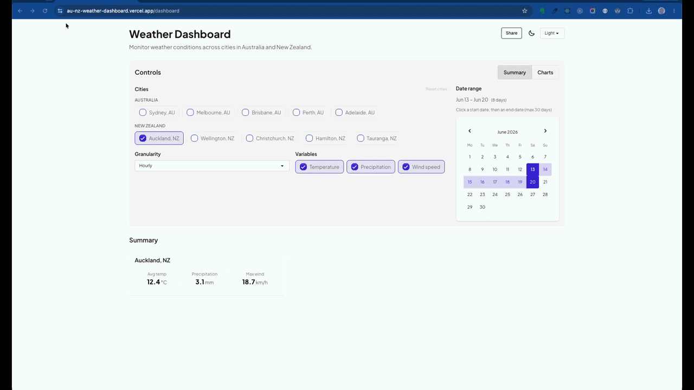
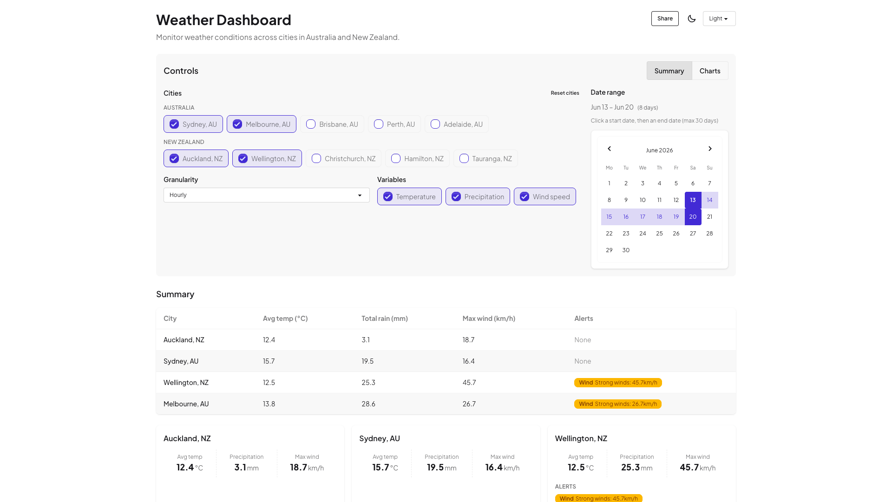
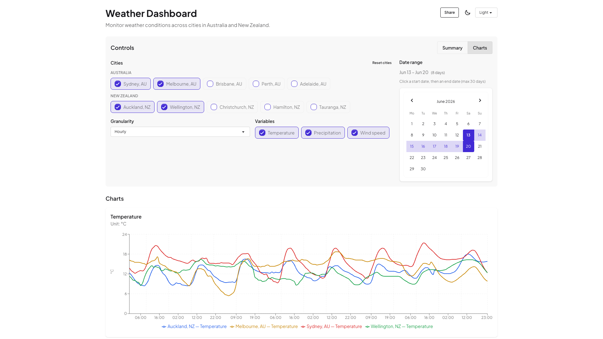
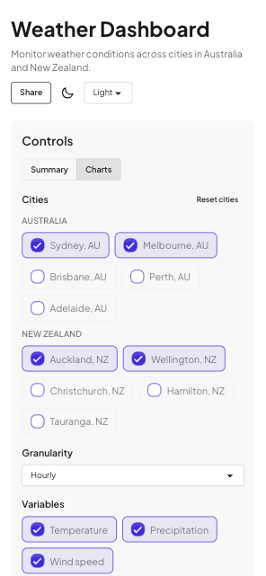

# AU/NZ Weather Dashboard

An interactive weather analytics dashboard for comparing conditions across Australia and New Zealand. Built with Next.js App Router, it pairs a **Summary** view (KPI cards and alerts) with a **Charts** view (interactive Recharts visualizations), all driven by shareable URL filters.

> **Live demo:** [https://au-nz-weather-dashboard.vercel.app](https://au-nz-weather-dashboard.vercel.app)

> **Lighthouse (production):** Performance 95 · Accessibility 97 · Best Practices 100 · SEO 91

## Highlights

| Area             | Details                                                                          |
| ---------------- | -------------------------------------------------------------------------------- |
| **Stack**        | Next.js 15 · React 19 · TypeScript · Tailwind CSS 4 · DaisyUI · Recharts · Zod   |
| **Architecture** | Server Components, API proxy with ISR (5 min), dynamic chart imports             |
| **State**        | URL-driven filters — bookmarkable, shareable dashboard views                     |
| **Quality**      | 209 unit/component tests · ~96% statement coverage · Playwright E2E · CI on push |
| **UX**           | Light / dark / cupcake themes · skeleton loading · accessible error states       |

## Features

- **Summary view** — side-by-side KPI cards (temperature, precipitation, wind) with weather alerts
- **Charts view** — line, bar, and area charts for temperature, rainfall, and wind
- **Filters** — multi-city selection (10 AU/NZ presets), hourly/daily granularity, variable picker, date range calendar (max 30 days)
- **URL state** — `view`, `city`, `gran`, `vars`, `start`, `end` parameters persist across reloads and shares
- **Resilience** — Open-Meteo proxy with coordinate validation, Zod schemas, and exponential-backoff retries
- **Accessibility** — semantic HTML, ARIA labels, keyboard-friendly controls, DaisyUI focus styles

## Screenshots



|                                        Summary                                        |                                          Charts                                          |                                      Mobile                                      |
| :-----------------------------------------------------------------------------------: | :--------------------------------------------------------------------------------------: | :------------------------------------------------------------------------------: |
|  |  |  |

## Quick start

**Prerequisites:** Node 20+, pnpm 9+

```bash
pnpm install
cp .env.example .env.local
pnpm dev
```

Open [http://localhost:3000/dashboard](http://localhost:3000/dashboard).

### Scripts

| Command              | Description                                                      |
| -------------------- | ---------------------------------------------------------------- |
| `pnpm dev`           | Development server                                               |
| `pnpm build`         | Production build                                                 |
| `pnpm test`          | Jest unit and component tests                                    |
| `pnpm test:coverage` | Tests with 80% coverage thresholds                               |
| `pnpm test:e2e`      | Playwright end-to-end tests                                      |
| `pnpm lighthouse`    | Lighthouse audit (`LIGHTHOUSE_URL` defaults to local dev server) |
| `pnpm lint:strict`   | ESLint with zero warnings                                        |
| `pnpm typecheck`     | TypeScript check                                                 |

## URL examples

Shareable dashboard states:

```
/dashboard
/dashboard?view=charts&city=auckland,sydney
/dashboard?view=summary&gran=daily&city=wellington,melbourne
/dashboard?view=charts&vars=temperature_2m,precipitation&start=2026-06-08&end=2026-06-15
```

## Project structure

```
src/
  app/
    dashboard/          # Main dashboard (Server Component)
    api/weather/        # Open-Meteo proxy with validation and caching
  components/           # UI — filters, KPIs, charts, theme toggle
  hooks/                # Client-side URL state sync
  lib/                  # Schemas, API helpers, KPI/alert logic
e2e/                    # Playwright tests
scripts/                # Lighthouse audit script
```

## Environment variables

| Variable                  | Description                               |
| ------------------------- | ----------------------------------------- |
| `NEXT_PUBLIC_BASE_URL`    | Public site URL for metadata and sitemaps |
| `NEXT_PUBLIC_SHOW_LOGGER` | Enable debug logging (`true` / `false`)   |

## Cities

**New Zealand:** Auckland, Wellington, Christchurch, Hamilton, Tauranga  
**Australia:** Sydney, Melbourne, Brisbane, Perth, Adelaide

## License

MIT
